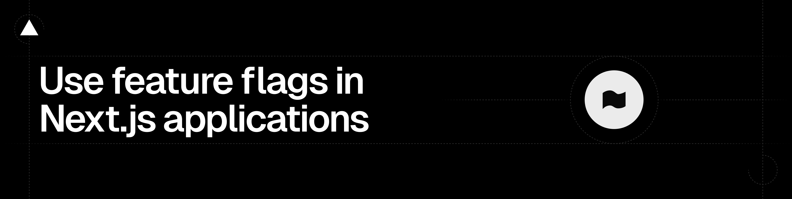

# `@vercel/flags`

The feature flags toolkit for Next.js and SvelteKit.

From the creators of Next.js, the Flags SDK is a free open-source library that gives you the tools you need to use feature flags in Next.js and SvelteKit applications.

- Works with any flag provider, custom setups or no flag provider at all
- Compatible with App Router, Pages Router, and Edge Middleware
- Built for feature flags and experimentation

See [flags-sdk.com](https://flags-sdk.com/) for full docs and examples.

## Installation

Install the package using your package manager:

```sh
npm install @vercel/flags
```

## Setup

Create an environment variable called `FLAGS_SECRET`.

The `FLAGS_SECRET` value must have a specific length (32 random bytes encoded in base64) to work as an encryption key. Create one using node:

```sh
node -e "console.log(crypto.randomBytes(32).toString('base64url'))"
```

This secret is required to use the SDK. It is used to read overrides and to encrypt flag values in case they are sent to the client and should stay secret.

## Usage

Create a file called flags.ts in your project and declare your first feature flag there:

```ts
// app/flags.tsx
import { flag } from '@vercel/flags/next';

export const exampleFlag = flag({
  key: 'example-flag',
  decide() {
    return true;
  },
});
```

Call your feature flag in a React Server Component:

```tsx
// app/page.tsx
import { exampleFlag } from '../flags';

export default async function Page() {
  const example = await exampleFlag();
  return <div>{example ? 'Flag is on' : 'Flag is off'}</div>;
}
```

Feature Flags can also be called in Edge Middleware and API Routes.

## Adapters

The Flags SDK has adapters for popular feature flag providers including LaunchDarkly, Optimizely, and Statsig.

## Documentation

There is a lot more to the Flags SDK than shown in the example above.

See the full documentation and examples on [flags-sdk.com](https://flags-sdk.com/).
